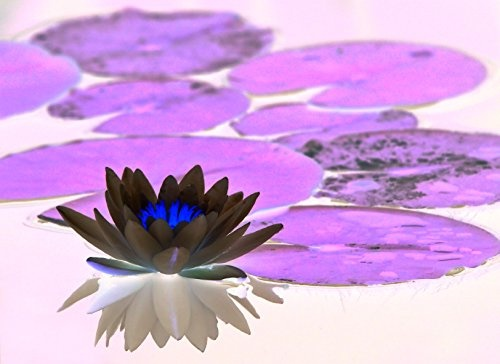

# Computer Vision
All of my image processing codes are uploaded here

# Flipping Image

It deals with all the flipping of the Image\

It includes the following :
1. Horizontal Flipping
2. vertical Flipping
3. Combined Flipping\

# Contrast Reduction

I have changed the contrast of the image by using "BITWISE-NOT" Operator\
Which later looks like as follows :\

# Reading, Splitting and Blurring

I am first defining three ways of Reading image\
i.e /
1. cv2.imread
2. cv2.cvtColor/

Image used in this Code are as follows :\
1. 
2. 

What you can find in the code :
1. Reading images using CV2
2. Defining RGB colour and then removing these Channel and at last accessing it through splitting
3. Blurring effect on an Image
